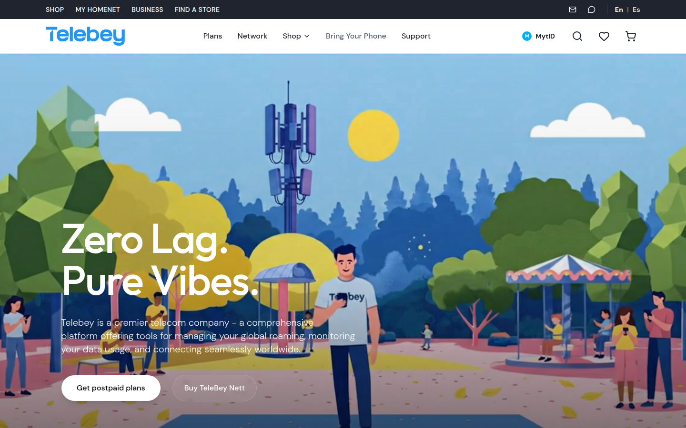
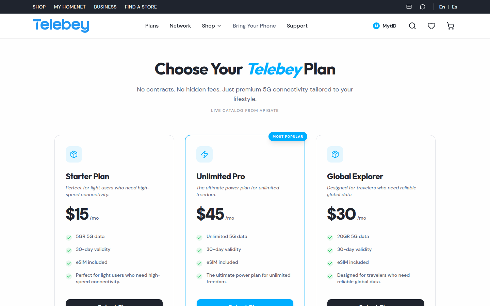
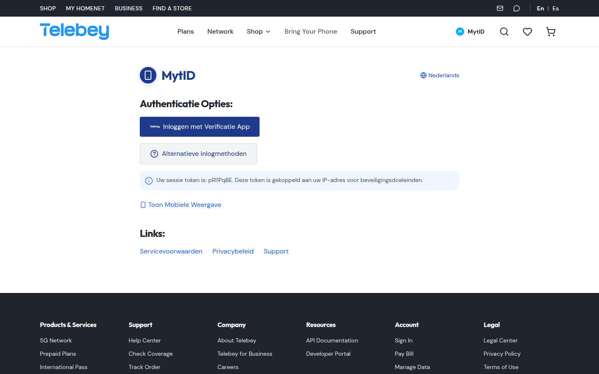
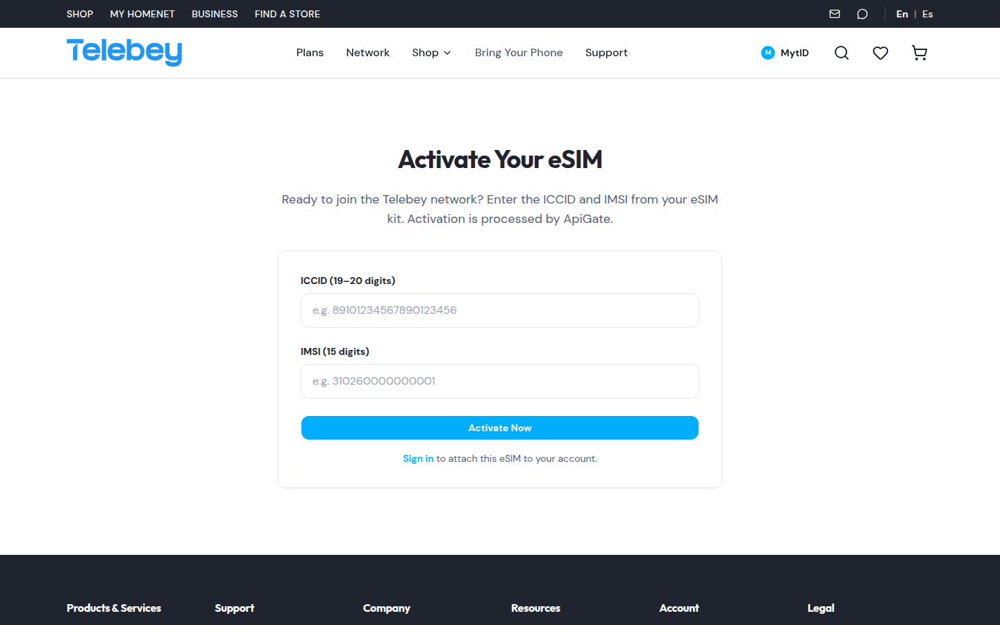
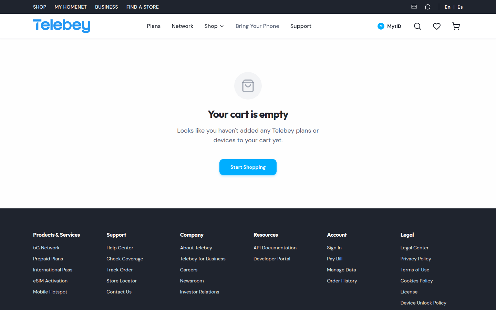
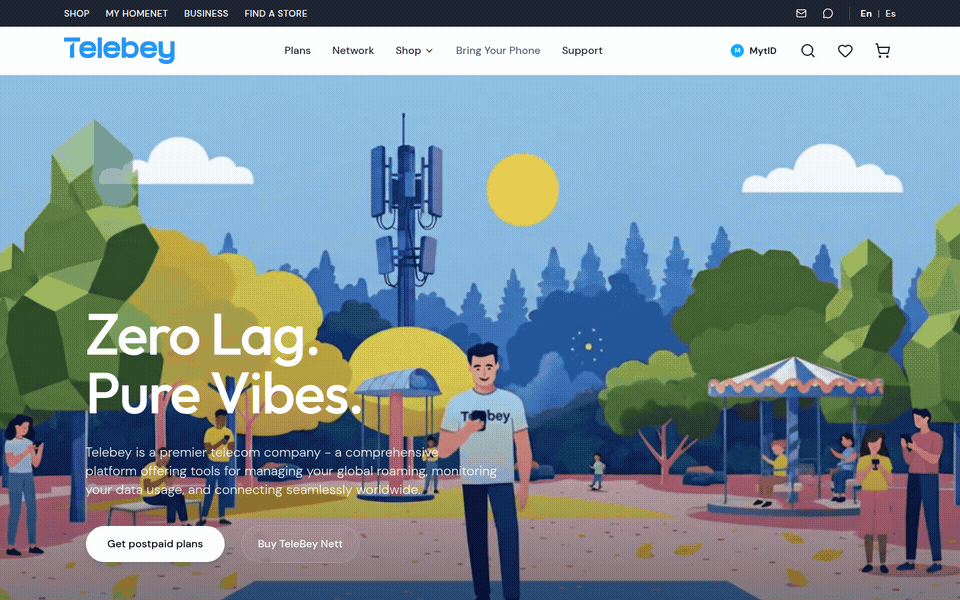

# Telebey ISP Web

Telebey is the customer-facing MVNO web app: plans, eSIM activation, account, cart, and identity login.

This frontend talks to **[ApiGate](https://github.com/TelebeyISP/ApiGate)** for authentication, data plans, and SIM lifecycle, and links to the **[Open5GS Router Dashboard](https://github.com/TelebeyISP/isp.router-dashboard)** for network administration.

## Screenshots

Captured from a live local run (Vite `:5173` + ApiGate `:4000`). The plans page shows **Live catalog from ApiGate**.

<p align="center">
  
</p>

**Home** — landing hero.

<p align="center">
  
</p>

**Plans** — live catalog from ApiGate (`GET /plans`).

<p align="center">
  
</p>

**Sign in** — MytID / `/auth`.

<p align="center">
  
</p>

**eSIM activation** — processed by ApiGate (`POST /sim/activate`).

<p align="center">
  
</p>

**Cart**

## Walkthrough

<p align="center">
  
</p>

Full recording: [docs/demo.mp4](docs/demo.mp4)

## Connect to ApiGate

ApiGate is the NestJS gateway at [TelebeyISP/ApiGate](https://github.com/TelebeyISP/ApiGate.git). In development the browser calls `/apigate/*`, and Vite proxies those requests to `http://127.0.0.1:4000`.

| Frontend | ApiGate |
| --- | --- |
| Email login / register | `POST /auth/login`, `POST /auth/register` |
| Session | `GET /auth/me`, `POST /auth/refresh`, `POST /auth/logout` |
| Plans catalog | `GET /plans` |
| SIM usage | `GET /sim` |
| eSIM activation | `POST /sim/activate` |
| Health | `GET /health` |

```bash
git clone https://github.com/TelebeyISP/ApiGate.git
cd ApiGate/telebey-platform/apps/api
npm install
npm run start:dev
```

```bash
cp .env.example .env.local
npm install
npm run dev
```

Open [http://localhost:5173](http://localhost:5173).

Demo accounts:

- User: `user@test.com` / `Test1234!`
- Admin: `admin@telebey.com` / `Admin1234!`

`VITE_APIGATE_URL=/apigate` uses the Vite proxy. Override the backend with `APIGATE_PROXY_TARGET` if ApiGate is not on localhost:4000.

Plans fall back to a local catalog if ApiGate is offline. Login, SIM usage, and eSIM activation require ApiGate.

## Connect to Router Dashboard

The [isp.router-dashboard](https://github.com/TelebeyISP/isp.router-dashboard.git) repo is the Open5GS administration UI. It manages subscribers, APN profiles, and WebUI accounts, and proxies ApiGate server-side at `/api/apigate/*`.

| Component | URL (dev) |
| --- | --- |
| This web app | [http://localhost:5173](http://localhost:5173) |
| ApiGate | [http://localhost:4000](http://localhost:4000) |
| Router dashboard | [http://localhost:9999](http://localhost:9999) |

From **My Account → Telebey Nett Settings**, signed-in users open the router dashboard in a new tab. Set `VITE_ROUTER_DASHBOARD_URL` if it is not on `http://localhost:9999`.

```bash
git clone https://github.com/TelebeyISP/isp.router-dashboard.git
cd isp.router-dashboard/webui
npm install
npm run dev
```

Default login: `admin` / `1423`. MongoDB must be reachable at `mongodb://127.0.0.1:27017/open5gs`. Run ApiGate alongside the dashboard so the **ApiGate** sidebar shows live health and plans.

## Stack

- React 19 + TypeScript + Vite
- Tailwind CSS + shadcn/ui
- Axios client in `src/lib/apigate.ts`
- ApiGate (NestJS) for auth / SIMs / plans
- Router dashboard (Open5GS WebUI) via `VITE_ROUTER_DASHBOARD_URL`
- Optional Sylius shop API for cart (`VITE_SYLIUS_API_URL`)
